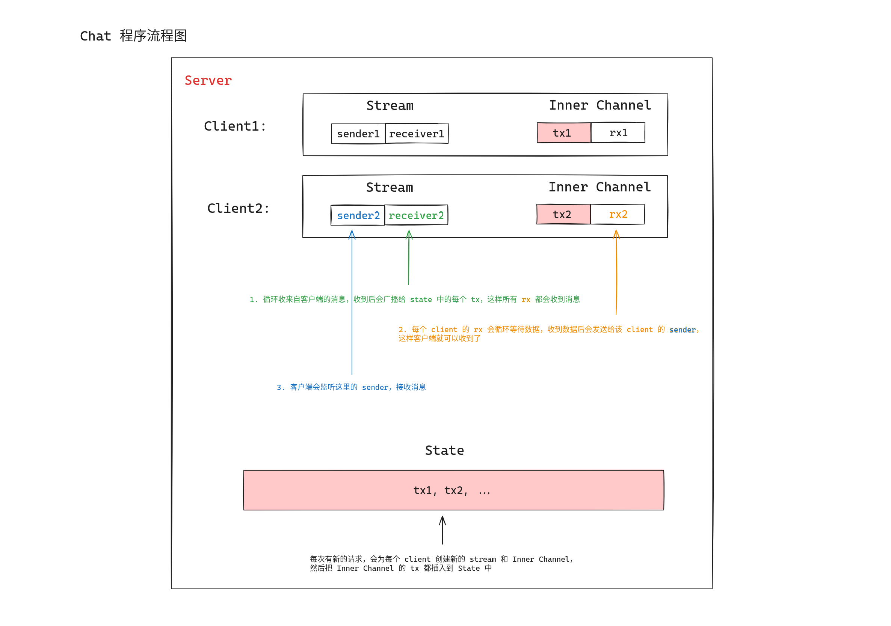

# Geektime Rust 语言训练营

召唤元素：Rust 生态系统概览

## proxy 测试方法
开两个 terminal，运行这两个程序
```
cargo run --example axum_serde
cargo run --example minginx
```

然后请求 test.rest 的
```
PATCH http://localhost:8081/
Content-Type: application/json

{
  "skills": ["Rust"]
}
```

这样我们的 minginx 可以代理 8081 的请求内容到 8080，得到正确的返回

## chat 测试方法

```
telent 127.0.0.1 8080 # chat server 就是按照 line 切换，文本交互的服务器，可以使用 telnet 登录
```

chat 服务器原理：


## tokio-console 使用
首先修改 `chat.rs` 的 main 函数里面使用 `console_subscriber::init();`

然后运行加上如下参数
```
RUSTFLAGS="--cfg tokio_unstable" cargo run --example chat
```

安装 tokio-console
```
cargo install --locked tokio-console
```

再执行 `tokio-console` 就可以看到效果了，更多用法可以看它的 github

## shortener 使用

安装:
```
sudo apt update
sudo apt install postgresql postgresql-contrib
sudo systemctl start postgresql.service
```

修改 postgres 密码
```
sudo -u postgres psql
postgres=# \password postgres
Enter new password: <new-password>
postgres=# \q
```

如果数据库没有创建的话要先创建
```
sudo -u postgres createdb shortener
```

运行完程序后，也可以在本地看数据库内容
```
sudo -u postgres psql
```

可以用 `\l` 命令显示所有数据库

连接 `shortener` 数据库:
```
\c shortener
# 会显示：
# You are now connected to database "shortener" as user "postgres".
```

可以看到数据库里面有什么表：
```
shortener=# \dt
        List of relations
 Schema | Name | Type  |  Owner
--------+------+-------+----------
 public | urls | table | postgres
(1 row)
```

也可以查看表里面内容：
```
shortener=# select * from urls;
   id   |                             url
--------+--------------------------------------------------------------
 FW0Utx | https://developer.mozilla.org/en-US/docs/Web/HTTP/Status/422
(1 row)
```
